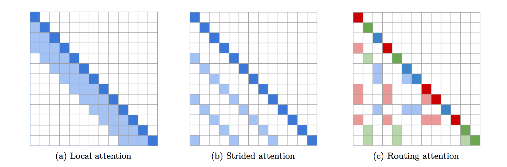

## Routing Transformer

</img>

[](https://badge.fury.io/py/routing-transformer)

A fully featured implementation of <a href="https://arxiv.org/pdf/2003.05997.pdf">Routing Transformer</a>. The paper proposes using k-nearest neighbors to route similar queries / keys into the same cluster for attention.

[](https://colab.research.google.com/drive/1sw1Hjx3EllhKZh4nhJ3TIZ978HjKVUFQ?usp=sharing) 131k tokens

### Install

```bash
$ pip install routing_transformer
```

### Usage

A simple language model

```python
import torch
from routing_transformer import RoutingTransformerLM

model = RoutingTransformerLM(
    num_tokens = 20000,
    dim = 512,
    heads = 8,
    depth = 12,
    max_seq_len = 8192,
    causal = True,           # auto-regressive or not
    emb_dim = 128,           # embedding factorization, from Albert
    weight_tie = False,      # weight tie layers, from Albert
    attn_dropout = 0.1,      # dropout after attention
    attn_layer_dropout = 0., # dropout after self attention layer
    ff_dropout = 0.1,        # feedforward dropout
    layer_dropout = 0.,      # layer dropout
    window_size = 128,       # target window size of each cluster
    n_local_attn_heads = 4,  # number of local attention heads
    reversible = True,       # reversible networks for memory savings, from Reformer paper
    ff_chunks = 10,          # feed forward chunking, from Reformer paper
    ff_glu = True,           # use GLU variant in feedforward
    pkm_layers = (4,7),      # specify layers to use product key memory. paper shows 1 or 2 modules near the middle of the transformer is best
    pkm_num_keys = 128,      # defaults to 128, but can be increased to 256 or 512 as memory allows
    num_mem_kv = 8           # number of memory key/values to append to each cluster of each head, from the 'All-Attention' paper. defaults to 1 in the causal case for unshared QK to work
).cuda()

x = torch.randint(0, 20000, (1, 8192)).long().cuda()
input_mask = torch.ones_like(x).bool().cuda()

y, aux_loss = model(x, input_mask = input_mask) # (1, 8192, 20000)
aux_loss.backward() # add auxiliary loss to main loss before backprop
```

A simple transformer

```python
import torch
from routing_transformer import RoutingTransformer

model = RoutingTransformer(
    dim = 512,
    heads = 8,
    depth = 12,
    max_seq_len = 8192,
    window_size = 128,
    n_local_attn_heads = 4
).cuda()

x = torch.randn(1, 8192, 512).cuda()
input_mask = torch.ones(1, 8192).bool().cuda()

y, aux_loss = model(x, input_mask = input_mask) # (1, 8192, 512)
aux_loss.backward() # add auxiliary loss to main loss before backprop
```

## Encoder Decoder

To use a full encoder, decoder, simply import the `RoutingTransformerEncDec` class. Save for the `dim` keyword, all other keywords will be either prepended with `enc_` or `dec_` for the encoder and decoder `RoutingTransformerLM` class respectively.

```python
import torch
from routing_transformer import RoutingTransformerEncDec

model = RoutingTransformerEncDec(
    dim=512,
    enc_num_tokens = 20000,
    enc_depth = 4,
    enc_heads = 8,
    enc_max_seq_len = 4096,
    enc_window_size = 128,
    dec_num_tokens = 20000,
    dec_depth = 4,
    dec_heads = 8,
    dec_max_seq_len = 4096,
    dec_window_size = 128,
).cuda()

src = torch.randint(0, 20000, (1, 4096)).cuda()
tgt = torch.randint(0, 20000, (1, 4096)).cuda()
src_mask = torch.ones_like(src).bool().cuda()
tgt_mask = torch.ones_like(tgt).bool().cuda()

loss = model(src, tgt, enc_input_mask = src_mask, dec_input_mask = tgt_mask, return_loss = True, randomly_truncate_sequence = True)
loss.backward()

# do your training, then to sample up to 2048 tokens based on the source sequence
src = torch.randint(0, 20000, (1, 4096)).cuda()
start_tokens = torch.ones(1, 1).long().cuda() # assume starting token is 1

sample = model.generate(src, start_tokens, seq_len = 2048, eos_token = 2) # (1, <= 2048, 20000)
```

## Product Key Memory

To see the benefits of using PKM, the learning rate of the values must be set higher than the rest of the parameters. (Recommended to be `1e-2`)

You can follow the instructions here to set it correctly https://github.com/lucidrains/product-key-memory#learning-rates

## Kmeans Hyperparameters

1. `kmeans_ema_decay = {defaults to 0.999}`

This is the exponential moving average decay for updating the k-means. The lower this is, the faster the means will adjust, but at the cost of stability.

2. `commitment_factor = {defaults to 1e-4}`

The weight of the auxiliary loss that encourages tokens to get closer (commit) to the k-mean centroids that were chosen for them.

## Issues

This architecture has trouble generalizing to shorter sequence lengths when decoding tokens from 1 -> maximum sequence length. The simplest and surest solution is to randomly truncate the sequence during training. This helps the network and the kmeans generalize to variable number of tokens, at the cost of prolonged training.

If you are priming the network with the full sequence length at start, then you will not face this problem, and you can skip this training procedure.


```python
import torch
from routing_transformer import RoutingTransformerLM, AutoregressiveWrapper

model = RoutingTransformerLM(
    num_tokens = 20000,
    dim = 1024,
    heads = 8,
    depth = 12,
    window_size = 256,
    max_seq_len = 8192,
    causal = True
)

model = AutoregressiveWrapper(model)

x = torch.randint(0, 20000, (1, 8192))
loss = model(x, return_loss = True, randomly_truncate_sequence = True) # (1, 8192, 20000)
```

## Appreciation

Special thanks to <a href="https://github.com/AranKomat">Aran Komatsuzaki</a> for bootstrapping the initial implementation in Pytorch that evolved into this library.

## Citation

```bibtex
@misc{roy*2020efficient,
    title   = {Efficient Content-Based Sparse Attention with Routing Transformers},
    author  = {Aurko Roy* and Mohammad Taghi Saffar* and David Grangier and Ashish Vaswani},
    year    = {2020},
    url     = {https://arxiv.org/pdf/2003.05997.pdf}
}
```

```bibtex
@misc{shazeer2020glu,
    title   = {GLU Variants Improve Transformer},
    author  = {Noam Shazeer},
    year    = {2020},
    url     = {https://arxiv.org/abs/2002.05202}    
}
```

```bibtex
@inproceedings{kitaev2020reformer,
    title       = {Reformer: The Efficient Transformer},
    author      = {Nikita Kitaev and Lukasz Kaiser and Anselm Levskaya},
    booktitle   = {International Conference on Learning Representations},
    year        = {2020},
    url         = {https://openreview.net/forum?id=rkgNKkHtvB}
}
```

```bibtex
@inproceedings{fan2020reducing,
    title     ={Reducing Transformer Depth on Demand with Structured Dropout},
    author    ={Angela Fan and Edouard Grave and Armand Joulin},
    booktitle ={International Conference on Learning Representations},
    year      ={2020},
    url       ={https://openreview.net/forum?id=SylO2yStDr}
}
```

```bibtex
@misc{lan2019albert,
    title       = {ALBERT: A Lite BERT for Self-supervised Learning of Language Representations},
    author      = {Zhenzhong Lan and Mingda Chen and Sebastian Goodman and Kevin Gimpel and Piyush Sharma and Radu Soricut},
    year        = {2019},
    url         = {https://arxiv.org/abs/1909.11942}
}
```

```bibtex
@misc{lample2019large,
    title   = {Large Memory Layers with Product Keys},
    author  = {Guillaume Lample and Alexandre Sablayrolles and Marc'Aurelio Ranzato and Ludovic Denoyer and Hervé Jégou},
    year    = {2019},
    eprint  = {1907.05242},
    archivePrefix = {arXiv}
}
```

```bibtex
@article{DBLP:journals/corr/abs-1907-01470,
    author    = {Sainbayar Sukhbaatar and
               Edouard Grave and
               Guillaume Lample and
               Herv{\'{e}} J{\'{e}}gou and
               Armand Joulin},
    title     = {Augmenting Self-attention with Persistent Memory},
    journal   = {CoRR},
    volume    = {abs/1907.01470},
    year      = {2019},
    url       = {http://arxiv.org/abs/1907.01470}
}
```
